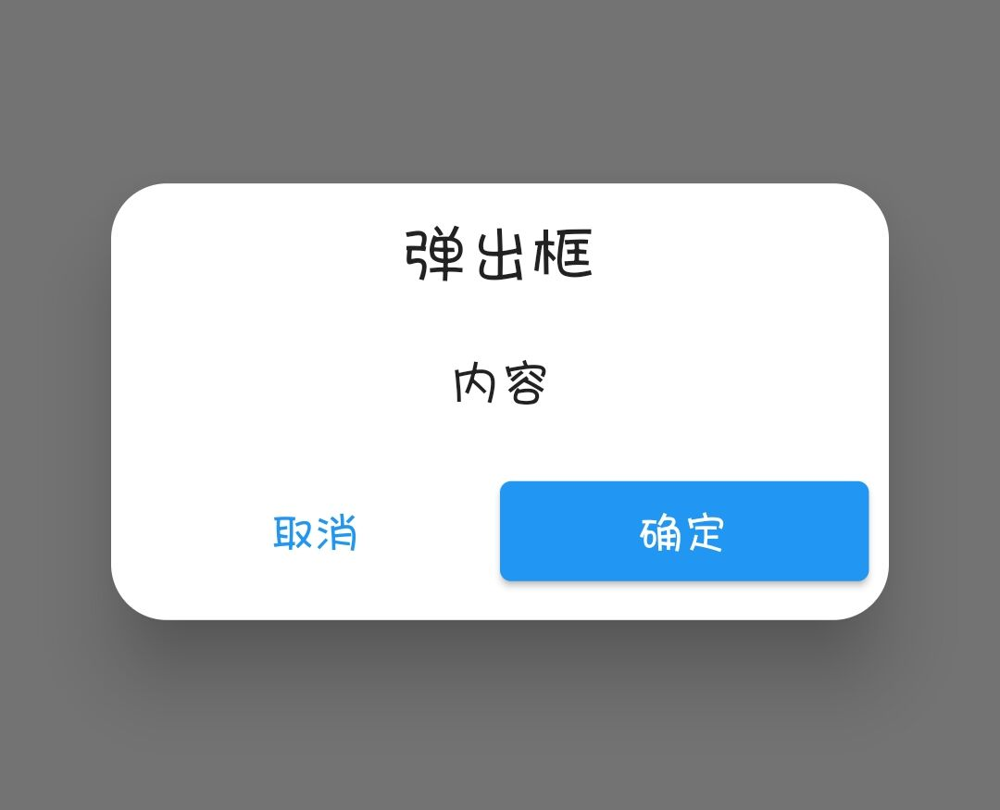
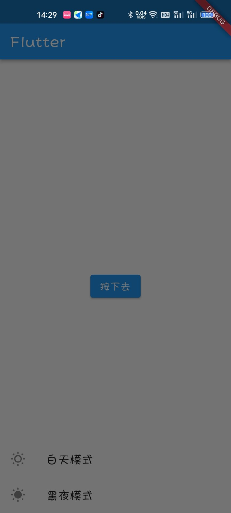
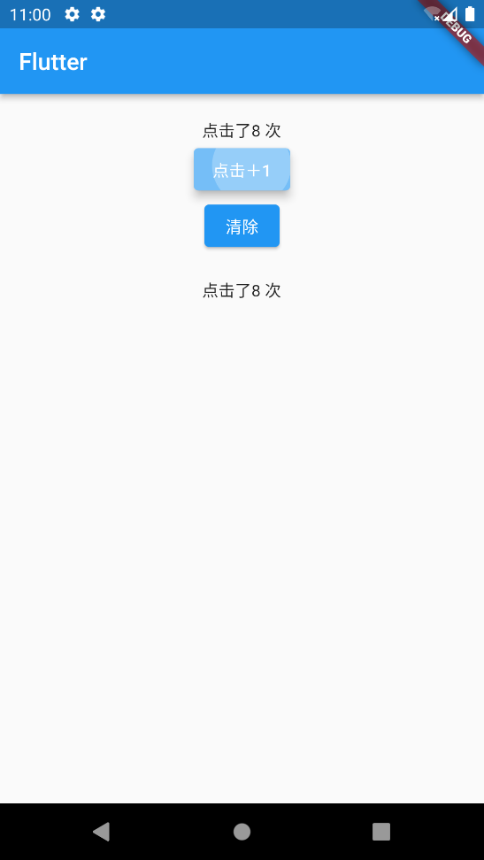

## 前言

急匆匆学完了 Flutter（当然后面肯定还要找时间巩固巩固），看的是 IT 营的 Flutter 基础课（也没记住多少），课程后面提到了 GetX，对于状态管理、路由、国际化等的帮助还是很大的，所以顺势就学了 GetX，官网的文档写的也不是特别完善，特别是对于我这种速成 Flutter 的**零基础**的，还是去 B 站找一个视频学习 GetX，初步筛选下，找到了这个视频：[Flutter GetX零基础视频教程](https://www.bilibili.com/video/BV1uq4y1U7fF/)。当然，这个视频里面讲的都是一些基础快速入门的内容，例如路由部分讲的不是特别详细，我会参考其他文章并且实践得到最佳使用方法并且记录下来。对于例如 `Obx` 的特别基本的使用我就不再记录，最终目标是写出尽量标准化的工程代码。

这位 up 主还有配套的博客教程：[Flutter GetX系列教程---介绍、Snackbar、Dialog、BottomSheet、Navigation、Obx | Jimi (liujunmin.com)](http://liujunmin.com/flutter/getx/introduction.html)

那么话不多说，开始学习。当然前面用的是真机进行测试的，后来换到了模拟器调试。

## 基本使用

一般来说我们在写 Flutter App 的时候，会使用 MaterialApp 作为应用顶层，如这样：

```dart
import 'package:flutter/material.dart';

void main() {
  runApp(const MyApp());
}

class MyApp extends StatelessWidget {
  const MyApp({super.key});

  @override
  Widget build(BuildContext context) {
    return MaterialApp(    // 使用 MaterialApp 作为应用顶层
      title: ...,
      home: ...,
    );
  }
}
```

如果我们使用 GetX，需要将 `MaterialApp` 替换为 `GetMaterialApp` ：

```dart
import 'package:flutter/material.dart';
import 'package:get/get.dart';    // 首先引入 GetX

void main() {
  runApp(const MyApp());
}

class MyApp extends StatelessWidget {
  const MyApp({super.key});

  @override
  Widget build(BuildContext context) {
    return GetMaterialApp(    // 使用 GetMaterialApp 作为应用顶层
      title: ...,
      home: ...,
    );
  }
}
```

使用 GetX 可以让我们尽量少使用 Stateful 组件，多的使用 Stateless 组件，提高应用性能。

## Snackbar

Snackbar 的作用就是弹出一个顶部消息提醒，如下图所示：


当点击按钮的时候顶部会弹出提示信息。

### Snackbar 基本使用

此组件的基本使用如下：

```dart
Get.snackbar(
    "Snackbar 标题",
    "欢迎使用Snackbar",
);
```

上面图片例子中，我们通过触发点击事件来执行此 Snackbar，提示标题为“Snackbar 标题”，提示内容为“欢迎使用Snackbar”。

完整组件代码如下：

```dart
class DemoWidget extends StatelessWidget {
  const DemoWidget({super.key});

  @override
  Widget build(BuildContext context) {
    // 按钮
    return Center(
        child: ElevatedButton(
            onPressed: () {
              Get.snackbar(
                "Snackbar 标题",
                "欢迎使用Snackbar",
              );
            },
            child: const Text("按下去")));
  }
}
```

我们查看一下参数列表：


可以看到 `Snackbar` 函数必传的参数为 `title` 和 `message` ，除此之外，`Snackbar` 函数还有其他可选参数，例如改变字体颜色，那么可以加上 `colorText` 参数，参数值类型为颜色类型：

```dart
Get.snackbar(
    "Snackbar 标题",
    "欢迎使用Snackbar",
    colorText: const Color.fromARGB(255, 207, 76, 76), // 改变字体颜色
);
```

### Snackbar 参数和说明

| 字段                             | 属性                   | 描述                                                         |
| -------------------------------- | ---------------------- | ------------------------------------------------------------ |
| title                            | String                 | 弹出的标题文字                                               |
| message                          | String                 | 弹出的消息文字                                               |
| colorText                        | Color                  | title和message的文字颜色                                     |
| duration                         | Duration               | Snackbar弹出的持续时间（默认3秒）                            |
| instantInit                      | bool                   | 当false可以把snackbar 放在initState，默认true                |
| snackPosition                    | SnackPosition          | 弹出时的位置，有两个选项【TOP，BOTTOM】默认TOP               |
| titleText                        | Widget                 | 弹出标题的组件，设置该属性会导致title属性失效                |
| messageText                      | Widget                 | 弹出消息的组件，设置该属性会导致messageText属性失效          |
| icon                             | Widget                 | 弹出时图标，显示在title和message的左侧                       |
| shouldIconPulse                  | bool                   | 弹出时图标是否闪烁，默认false                                |
| maxWidth                         | double                 | Snackbar最大的宽度                                           |
| margin                           | EdgeInsets             | Snackbar外边距，默认zero                                     |
| padding                          | EdgeInsets             | Snackbar内边距，默认EdgeInsets.all(16)                       |
| borderRadius                     | double                 | 边框圆角大小，默认15                                         |
| borderColor                      | Color                  | 边框的颜色，必须设置borderWidth，否则无效果                  |
| borderWidth                      | double                 | 边框的线条宽度                                               |
| backgroundColor                  | Color                  | Snackbar背景颜色，默认Colors.grey.withOpacity(0.2)           |
| leftBarIndicatorColor            | Color                  | 左侧指示器的颜色                                             |
| boxShadows                       | List                   | Snackbar阴影颜色                                             |
| backgroundGradient               | Gradient               | 背景的线性颜色                                               |
| mainButton                       | TextButton             | 主要按钮，一般显示发送、确认按钮                             |
| onTap                            | OnTap                  | 点击Snackbar事件回调                                         |
| isDismissible                    | bool                   | 是否开启Snackbar手势关闭，可配合dismissDirection使用         |
| showProgressIndicator            | bool                   | 是否显示进度条指示器，默认false                              |
| dismissDirection                 | SnackDismissDirection  | Snackbar关闭的方向                                           |
| progressIndicatorController      | AnimationController    | 进度条指示器的动画控制器                                     |
| progressIndicatorBackgroundColor | Color                  | 进度条指示器的背景颜色                                       |
| progressIndicatorValueColor      | Animation              | 进度条指示器的背景颜色，Animation                            |
| snackStyle                       | SnackStyle             | Snackbar是否会附加到屏幕边缘                                 |
| forwardAnimationCurve            | Curve                  | Snackbar弹出的动画，默认Curves.easeOutCirc                   |
| reverseAnimationCurve            | Curve                  | Snackbar消失的动画，默认Curves.easeOutCirc                   |
| animationDuration                | Duration               | Snackbar弹出和小时的动画时长，默认1秒                        |
| barBlur                          | double                 | Snackbar背景的模糊度                                         |
| overlayBlur                      | double                 | 弹出时的毛玻璃效果值，默认0                                  |
| snackbarStatus                   | SnackbarStatusCallback | Snackbar弹出或消失时的事件回调（即将打开、已打开、即将关闭、已关闭） |
| overlayColor                     | Color                  | 弹出时的毛玻璃的背景颜色                                     |
| userInputForm                    | Form                   | 用户输入表单                                                 |

## Dialog

`Dialog` 即弹出框，实际是对 `AlertDialog` 进行了封装。


当然我们可以对 `Dialog` 再次进行封装，以满足我们统一风格的定制。

我们可以新建一个 dart 文件，对 GetX 进行定制，包装成类或者函数供我们进行使用。

### Dialog 的基本使用

```dart
Get.defaultDialog();
```

在没有传任何参数时，效果如上图所示，GetX 的对话框有默认的文字，当我们传入参数后，文字会被替换掉。


下面的代码是弹出一个带有确认和取消按钮的弹出框：

```dart
Get.defaultDialog(
    title: "弹出框",
    content: const Text("内容"),
    textConfirm: "确定",
    textCancel: "取消",
);
```


这个确定按钮是禁用的因为我们没有传入处理事件。

默认的确认、取消的按钮样式不是很好看，我们可以使用 `confirm` 和 `cancel` 参数来定义我们的确定和取消按钮。不过想要达到类似于 QQ 那样平铺分配的按钮，我们需要使用 `actions` 来定义我们的按钮列表，例如：

```dart
Get.defaultDialog(
    title: "弹出框",
    content: const Text("内容"),
    actions: [
      Row(
        mainAxisAlignment: MainAxisAlignment.center,
        children: [
          Expanded(
            flex: 1,
            child: TextButton(
              onPressed: () {
                Get.back();
              },
              child: const Text("取消"),
            ),
          ),
          Expanded(
            flex: 1,
            child: ElevatedButton(
              onPressed: () {
                Get.back();
              },
              child: const Text("确定"),
            ),
          ),
        ],
      )
    ]
);
```

效果如下：



上面例子我们可以进一步修改，例如将 `padding` 设为 `0` 然后修改按钮样式或者使用 `Container` 替换掉默认按钮，以达到我们想要的效果，例如 QQ 的弹出框：


可以调整一下 `padding` 以及文字颜色背景颜色、圆角等达到类似的效果。

在调整好后可以进行封装等操作，方便我们在不同地方多次调用。

除此之外，其他的一些参数也是比较有用的。

### Dialog 参数和说明

| 字段               | 属性               | 描述                                         |
| ------------------ | ------------------ | -------------------------------------------- |
| title              | String             | 弹出的标题，默认（Alert)                     |
| titlePadding       | EdgeInsetsGeometry | 标题的内边距，默认（EdgeInsets.all(8)）      |
| titleStyle         | TextStyle          | 标题的样式                                   |
| middleText         | String             | 中间内容区域显示的文字                       |
| middleTextStyle    | TextStyle          | 中间内容区域显示的文字样式                   |
| content            | Widget             | 弹出的内容，该值设置后middleText将无效       |
| contentPadding     | EdgeInsetsGeometry | 内容的内边距，默认（EdgeInsets.all(8)）      |
| onConfirm          | VoidCallback       | 确认按钮回调                                 |
| onCancel           | VoidCallback       | 取消按钮回调                                 |
| onCustom           | VoidCallback       | 自定义按钮回调                               |
| cancelTextColor    | Color              | 取消按钮文字的颜色                           |
| confirmTextColor   | Color              | 确认按钮文字的颜色                           |
| textConfirm        | String             | 确认按钮的文字                               |
| textCancel         | String             | 取消按钮的文字                               |
| textCustom         | String             | 自定义按钮的文字                             |
| confirm            | Widget             | 确认按钮的组件                               |
| cancel             | Widget             | 取消按钮的组件                               |
| custom             | Widget             | 自定义按钮的组件                             |
| backgroundColor    | Color              | 弹出框的背景颜色                             |
| barrierDismissible | bool               | 是否可以通过点击背景关闭弹窗                 |
| buttonColor        | Color              | 按钮的文字颜色，根据按钮类型来设定不同的位置 |
| radius             | double             | 弹出框的圆角大小，默认20                     |
| actions            | List               | 增加额外的子组件                             |
| onWillPop          | WillPopCallback    | 拦截关闭之前做一些操作                       |
| navigatorKey       | GlobalKey          | 用于打开对话框的key                          |

## BottomSheet

`BottomSheet` 是底部弹出层。

###  BottomSheet 的基本使用

使用 `Get.bottomSheet` 来创建显示一个底部弹出层：

```dart
Get.bottomSheet(
	// ....里面放入组件
)
```

例如：

```dart
Get.bottomSheet(
    Container(
        child: Wrap(
          children: [
            ListTile(
              leading: const Icon(Icons.wb_sunny_outlined),
              title: const Text("白天模式"),
              onTap: () {
                Get.changeTheme(ThemeData.light());
              },
            ),
            ListTile(
              leading: const Icon(Icons.wb_sunny),
              title: const Text("黑夜模式"),
              onTap: () {
                Get.changeTheme(ThemeData.dark());
              },
            )
          ],
        ),
    )
);
```



我们实现的效果为：按下按钮执行 `Get.bottomSheet` 创建一个包含 “白天模式” 和 “黑夜模式” 的列表底部弹出。当点击对应的项时，使用 GetX 的功能进行主题的切换（后面会提到）。

上面的例子中，仅仅在底部弹出层里添加一个 `Container`，里面包含一个列表，没有配置背景色，因此没有背景，直接看到后面的半透明黑色幕布，当我们为 `Container` 添加一个背景色时，可以看到如下效果：

```dart
Container(
    decoration: const BoxDecoration(
      borderRadius: BorderRadius.only(
          topLeft: Radius.circular(10),
          topRight: Radius.circular(10)
      ), // 左上、右上圆角
      color: Colors.white, // 背景色
    ),
    child: ....,
)
```


当然，上面是我们最原始的实现方法，也适合高度定制，`Get.bottomSheet` 里面有参数可以供我们修改背景色和圆角形状，具体参数列表如下：

### BottomSheet 参数和说明

| 字段                     | 属性          | 描述                         |
| ------------------------ | ------------- | ---------------------------- |
| bottomsheet              | Widget        | 弹出的Widget组件             |
| backgroundColor          | Color         | bottomsheet的背景颜色        |
| elevation                | double        | bottomsheet的阴影            |
| persistent               | bool          | 是否添加到路由中             |
| shape                    | ShapeBorder   | 边框形状，一般用于圆角效果   |
| clipBehavior             | Clip          | 裁剪的方式                   |
| barrierColor             | Color         | 弹出层的背景颜色             |
| ignoreSafeArea           | bool          | 是否忽略安全适配             |
| isScrollControlled       | bool          | 是否支持全屏弹出，默认false  |
| useRootNavigator         | bool          | 是否使用根导航               |
| isDismissible            | bool          | 点击背景是否可关闭，默认ture |
| enableDrag               | bool          | 是否可以拖动关闭，默认true   |
| settings                 | RouteSettings | 路由设置                     |
| enterBottomSheetDuration | Duration      | bottomsheet进入时的动画时间  |
| exitBottomSheetDuration  | Duration      | bottomsheet退出时的动画时间  |

## Navigation

原生的 Flutter 自带了路由转跳，但是需要我们写许多代码，而 GetX 为我们进行了封装简化以及一些动画设置。

### Navigation 的基本使用

#### 使用 `to` 方法进行路由转跳

```dart
import 'package:path/home.dart';
Get.to(() => const Home());
```

我们可以在函数参数里面配置切换动画，可参考下图的参数列表配置参数：


其中，最常用的为 `transition` 切换动画以及 `arguments` 参数传递。

接受转跳页面的传参：

```dart
var data = await Get.to(() => const Home(), arguments: "Hello World"); // 转跳到 Home 页，并且携带参数 Hello World
print(data);  // 接收转跳到的 Home 页传来的数据
```

注意：`await` 的出现代表着该触发函数需要为 `async`。

当然，在转跳的 Home 页里，当我们返回转跳过来的父页面，想要传递数据要这样使用：

```dart
Get.back(result: "返回的数据");
```

转跳页面并携带参数的 `arguments` 函数参数在 `toNamed` 函数也是适用的。

#### 使用 `toNamed` 方法进行路由转跳

- 在应用程序入口 `GetMaterialApp` 进行路由配置，当然我们可以写成一个路由文件然后进行导入。

  ```dart
  import 'package:flutter/material.dart';
  import 'package:path/home.dart';
  import 'package:path/my.dart';
  import 'package:get/get.dart';
  
  void main() {
    runApp(MyApp());
  }
  
  class MyApp extends StatelessWidget {
    @override
    Widget build(BuildContext context) {
      return GetMaterialApp(
        title: "GetX",
        initialRoute: "/",
        defaultTransition: Transition.zoom,
        getPages: [
          GetPage(name: "/", page: () => const MyApp()),
          GetPage(name: "/home", page: () => const Home()),
          GetPage(name: "/my", page: () => const My(), transition: Transition.rightToLeft)
        ],
        home: MyDemo(),
      );
    }
  }
  ```

  其中 `initialRoute` 配置应用的根路由为：“`/`”。

  `defaultTransition` 配置默认的切换路由动画效果 `zoom`。

  `getPages` 配置我们的三个路由：`/`、`/home`、`/my`，并且使用 `transition` 参数来配置该路由的切换动画效果。后面会提到中间件的配置。`getPages` 配置比较多，可以参考官方文档进行配置。

- 在组件中调用 `toNamed`

  ```dart
  Get.toNamed("/my");
  ```

下图为 `Get.toNamed` 的参数列表


#### 使用 `back` 方法进行返回上一页

上面提到获取转跳的页面返回时的传参，使用的就是 `Get.back();`。

我们如果要返回上一个页面并携带参数，需要在 `back` 方法里加入 `result` 参数。

```dart
Get.back(result: "数据");
```

#### 使用 `off` 方法替换当前页面

与 React Router 类似，其中转跳方法里面有参数 `replace`，即替换当前页面而不是新开一个页面，因此使用替换当前页面进行页面的转跳，不能通过 `back` 方法返回上一页，若使用 `back` 方法，则返回的是上上个页面（如果上上个页面转跳上个页面用的不是 `off` 方法）。

```dart
Get.off(() => const Home());
Get.off("/home");
```

#### 使用 `offAll` 打开新页面，并关闭之前的所有页面

```dart
Get.offAll(() => const Home());
Get.offAll("/home");
```

#### `arguments` 传值的接收

通过 `Get.arguments` 进行传参值的接收：

```dart
class Home extends StatelessWidget {
  const Home({super.key});

  @override
  Widget build(BuildContext context) {
    print(Get.arguments); // 打印出参数值
    return Scaffold(
      appBar: ...,
      body: ...,
    );
  }
}
```

#### `parameters` 传值的接收

通过 `Get.parameters` 进行传值的接收，注意，`parameters` 传值类似于 URL 中的 `parameters` 传值，即路由地址加上 `?data=data`。

``` dart
class Home extends StatelessWidget {
  const Home({super.key});

  @override
  Widget build(BuildContext context) {
    print(Get.parameters); // 打印出参数值
    return Scaffold(
      appBar: ...,
      body: ...,
    );
  }
}
```

#### 使用中间件进行认证等操作

在使用 `toNamed` 方法配置路由列表的时候，使用 `GetPage` 进行路由的创建，其中 `middlewares` 参数配置我们的中间件，`middlewares` 里面为中间件的 `List`：

```dart
// 白名单
GetPage(
  name: AppRoutes.Login,
  page: () => LoginView(),
),
// 需要鉴权的路由
GetPage(
  name: AppRoutes.My,
  page: () => MyView(),
  middlewares: [
    RouteAuthMiddleware(),
  ],
),
```

其中，`RouteAuthMiddleware` 为：

我们在中间件中需要重写 `redirect` 方法，我们在里面处理路由的跳转，例如满足条件继续加载到目标路由或者不满足条件，跳转到登录页等。

如果我们不进行其他处理，继续跳转到目标路由，我们可以返回一个 `null`，如果进行跳转，可以直接返回一个 `RouteSettings` 函数，参数有两个：`name` 即路由名称地址、`arguments` 即传参，都是可选值，但是如果 `name` 不配置的话，会导致报错喔。

```dart
class RouteAuthMiddleware extends GetMiddleware {
  //需要继承GetMiddleware
  @override
  //需要实现系统的该方法
  RouteSettings? redirect(String? route) {
    //根据条件进行判断,满足条件进行跳转,否则不进行跳转（return null）
    if(满足条件) {
        return null; // 表示跳转到目标路由
    }
    return RouteSettings(name: "/login",arguments: {}); // 同时传参
  }
}
```

## Obx 响应式状态管理

### 定义 Obx 变量的三种方式

- 第一种 使用 `Rx{Type}`

    ```dart
    final name = RxString('');  // 字符串
    final isLogged = RxBool(false); // 布尔
    final count = RxInt(0); // 整型
    final balance = RxDouble(0.0); // 浮点数
    final items = RxList<String>([]); // List
    final myMap = RxMap<String, int>({}); // Map
    ```

- 第二种 使用 `Rx`，规定泛型 `Rx<Type>`。

  ```dart
  final name = Rx<String>(''); // 字符串
  final isLogged = Rx<Bool>(false); // 布尔
  final count = Rx<Int>(0); // 整型
  final balance = Rx<Double>(0.0); // 浮点数
  final number = Rx<Num>(0); // 数字
  final items = Rx<List<String>>([]); // 字符串 List
  final myMap = Rx<Map<String, int>>({}); // 字符串、数字 List
  // 自定义类 - 可以是任何类
  final user = Rx<User>();
  ```

- 第三种 只需添加 `.obs` 作为 `value` 的属性。（更实用、更简单、更可取的方法）

  ```dart
  final name = ''.obs;
  final isLogged = false.obs;
  final count = 0.obs;
  final balance = 0.0.obs;
  final number = 0.obs;
  final items = <String>[].obs;
  final myMap = <String, int>{}.obs;
  // 自定义类 - 可以是任何类
  final user = User().obs;
  ```

对于 Obx 的基础使用我这里就不再记录，因为后面会用到 `GetXController` 对 Obx 进行进阶使用，更符合写项目时候的代码习惯，如果结合 `GetXController` 使用能够理解的话，那么 Obx 的基础使用就自然而然就会了。

下面先讲述结合 `GetXController` 使用 Obx，后面再对 `GetXController` 进行具体记录。

当然，在使用 `GetXController` 进行控制 Obx 变量时，我们最好将变量及其操作函数放在一个类里面并放到单独的文件内，例如：

```dart
class CounterController extends GetxController {
  var count = 0.obs;
  increment() => count++;
  clear() => count.value = 0;
}
```

当我们在使用的时候，只需要引入此文件，在组件里面进行初始化等操作。

例如我们在主页面初始化控制器，使用 `Get.put()` 方法初始化一个控制器并赋值给类型为 `CounterController` （我们创建的控制器类）的变量 `c`：

```dart
class DemoWidget extends StatelessWidget {
  DemoWidget({super.key});
  final CounterController c = Get.put(CounterController()); // 初始化控制器
  @override
  Widget build(BuildContext context) {
    return Center(
      child: Column(children: [
        Container(
          margin: const EdgeInsets.only(top: 20),
          child: Obx(() => Text("点击了${c.count} 次")),  // 使用值
        ),
        ElevatedButton(
            onPressed: () {
              c.increment(); // 执行操作函数
            },
            child: const Text("点击＋1")),
        ElevatedButton(
            onPressed: () {
              c.clear(); // 执行操作函数
            },
            child: const Text("清除")),
      ]),
    );
  }
}
```

我们使用变量的时候需要在外面包裹 `Obx` 函数。

若我们在其他组件里想要调用相同的控制器，可以在该文件里引入我们控制器类所在的文件（如果其他组件与上面的这个主页面组件在一个文件里就不需要重复引入），并且在组件里使用 `Get.find()` 方法找到正在使用的相同控制器：

```dart
import 'package:flutter/material.dart';
// getx
import 'package:get/get.dart';
// 我们的控制器类放到了该文件内
import './store.dart';

class Test extends StatelessWidget {
  final CounterController c = Get.find<CounterController>(); // 找到控制器并赋值给 c
  Test({super.key});

  @override
  Widget build(BuildContext context) {
    return Obx(() => Text("点击了${c.count} 次")); // 使用
  }
}
```

这样，在主页面“清除”按钮后加上这个 `Test` 组件，运行可看到如下效果：



## GetXController

GetXController 主要作用就是 UI 代码和业务逻辑的分离。在前面记录的 Obx 的使用，他就是结合了 GetXController 进行管理的，并且其中 `Obx()` 即其中的一种

### 三种创建方式

首先：

```dart
class MyController extends GetxController {
```

- 第一种

  ```dart
  var teacher = Teacher();
  void convertToUpperCase() {
  	teacher.name.value = teacher.name.value.toUpperCase();
  }
  ```

- 第二种

  ```dart
  var teacher =  Teacher(name: "Jimi", age: 18).obs;
  void convertToUpperCase() {
  	teacher.update((val) {
  		teacher.value.name = teacher.value.name.toString().toUpperCase();
  	});
  }
  ```

- 第三种

  ```dart
  var teacher = Teacher();
  void convertToUpperCase() {
      teacher.name.value = teacher.name.value.toUpperCase();
      update();
  }
  ```

```dart
}
```

这样把它们放在 `MyController` 类（继承 `GetxController`）里，就实现了控制器的创建。

### 实例化控制器并使用（三种使用方式）

例如我们提前创建好上方的控制器类，下面要在组件里面实例化：

```dart
MyController myController = Get.put(MyController());
```

实例化之后可以在子组件里进行使用，有三种方式：

- 第一种

  ```dart
  Obx(() => Text(
     "我的名字是 ${myController.teacher.name}",
     style: TextStyle(color: Colors.red, fontSize: 30),
  )),
  ```

- 第二种

  ```dart
  GetX<MyController>(
     init: MyController(),
     builder: (controller) {
        return Text(
           "我的名字是 ${controller.teacher.name}",
           style: TextStyle(color: Colors.green, fontSize: 30),
        );
     },
  ),
  ```

- 第三种

  ```dart
  GetBuilder<MyController>(
      init: myController,
      builder: (controller) {
          return Text(
              "我的名字是 ${controller.teacher.name}",
              style: TextStyle(color: Colors.green, fontSize: 30),
          );
      },
  ),
  ```

在前面的 Obx 的使用中已经介绍过第一种使用方法了。

### 事件监听

上面我们已经学会了创建控制器，这里我们简单的创建一个：

```dart
class WorkersController extends GetxController {
  var count = 0.obs;

  void increment() {
    count++;
  }
}
```

想要实现事件的监听，我们需要在类里重写 `onInit` 事件：

```dart
@override
void onInit() {

  // 监听count的值，当它发生改变的时候调用
  ever(count, (callback) => print("ever----$count"));

  // 监听多个值，当它们发生改变的时候调用
  everAll([count], (callback) => print("everAll----$count"));

  // count值改变时调用，只执行一次
  once(count, (callback) => print("once----$count"));

  // 用户停止打字时1秒后调用，主要是防抖
  debounce(count, (callback) => print("debounce----$count"));

  // 忽略3秒内的所有变动
  interval(count, (callback) => print("interval----$count"));

  super.onInit();
}
```

### 生命周期

在创建控制器类的时候，我们可以重写生命周期方法：

```dart
@override
void onInit() {
  // TODO: implement onInit
  print("初始化");
  super.onInit();
}

@override
void onReady() {
  // TODO: implement onReady
  print("加载完成");
  super.onReady();
}

@override
void onClose() {
  // TODO: implement onClose
  print("控制器被释放");
  super.onClose();
}
```

然后实例化使用：

```dart
GetBuilder<MyLifecycleController>(
    initState: (data) => myLifecycleController.increment(),
    dispose: (_) => myLifecycleController.cleanTask(),
    builder: (controller) {
        return Text(
            "计数器值为: ${myLifecycleController.count}",
            style: TextStyle(color: Colors.green, fontSize: 30),
        );
    },
),
```

上面代码当组件销毁的时候会执行 `cleanTask()` 清除计数器数据，初始化的时候会执行 `increment()`。

### UniqueID

我们在开发的过程中会碰到一种情况，就是多个地方引用了同一个属性，但我只想单独更新某一个地方，那么就可以用`UniqueID`来进行区分。

在创建控制器的时候加入 UniqueID：

```dart
import 'package:get/get.dart';

class CountController extends GetxController {
  var count = 0;

  void increment() {
    count++;
    update(['jimi_count']); // 在这里写入 id
  }
  
  void increment2() {
    count++;
    update();
  }
}
```

在实例化使用的时候：

```dart
GetBuilder<CountController>(
    id: 'jimi_count', // 加入 id
    builder: (controller) {
        return Text(
            "计数器值为: ${controller.count}",
            style: TextStyle(color: Colors.green, fontSize: 30),
        );
    },
),
GetBuilder<CountController>(
    builder: (controller) {
        return Text(
            "计数器值为: ${controller.count}",
            style: TextStyle(color: Colors.green, fontSize: 30),
        );
    },
),
```

此时如果触发 `increment()` ，上面的组件会显示 `count` 自增1，而下面的不会，触发 `increment2()`，下面的组件会在上面的组件的显示的 `count` 的值的基础上自增1，也就是说触发哪个 `increment` 都会导致 `count` 自增1，但是根据 id 的不同（2中没有标明id，但是这种情况下与1中指定的有所区分），组件显示的也会不同，标有相应id的组件会显示变化的值。

例如此时的 `children` 如下：

```dart
children: [
    GetBuilder<CountController>(
      builder: (controller) {
        return Text(
          "计数器值为: ${controller.count}",
          style: TextStyle(color: Colors.red, fontSize: 30),
        );
      },
    ),
    GetBuilder<CountController>(
      builder: (controller) {
        return Text(
          "计数器值为: ${controller.count}",
          style: TextStyle(color: Colors.red, fontSize: 30),
        );
      },
    ),
    GetBuilder<CountController>(
      id: 'jimi_count',
      builder: (controller) {
        return Text(
          "计数器值为: ${controller.count}",
          style: TextStyle(color: Colors.green, fontSize: 30),
        );
      },
    ),
    SizedBox(
      height: 20,
    ),
    ElevatedButton(
        onPressed: () => countController.increment(),
        child: Text("增加")),
    ElevatedButton(
        onPressed: () => countController.increment2(),
        child: Text("增加2"))
],
```

当我们点击”增加“按钮时，第一个和第二个组件同时会变化（因为没有指定id，与已指定id的有所区别），变化后的值为1，第三个组件的值不会变化，仍为0。当我们两次点击”增加2“按钮时，第三个组件会变化（第一第二无变化），变化后的值为3，因为我们指定了id，如果再加上同一个id的组件，值内容也会跟第三个组件一样变化，第一第二个组件不变化，值仍为1。再点击”增加“按钮时，第一第二个组件会变化，变化后的值为4，第三个组件仍为3。

看上面的文字有点绕脑子，自己手写一遍就会非常清晰明了。

## 国际化配置

还在学习，未完待续……最后更新日期：2023/07/10 23:59:38
